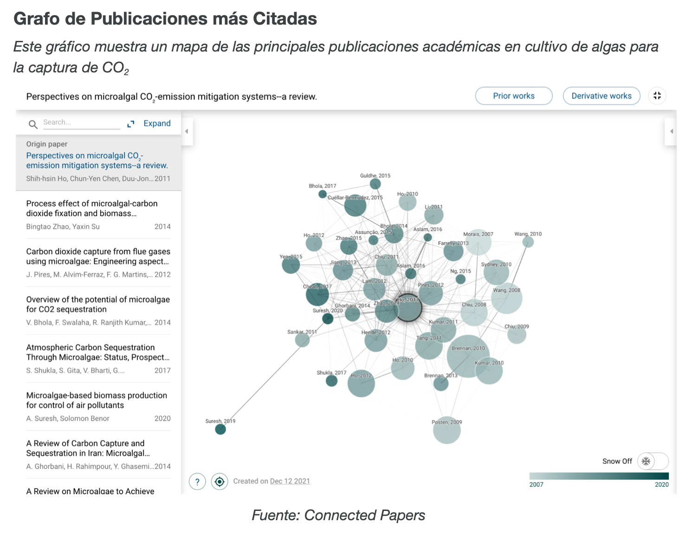
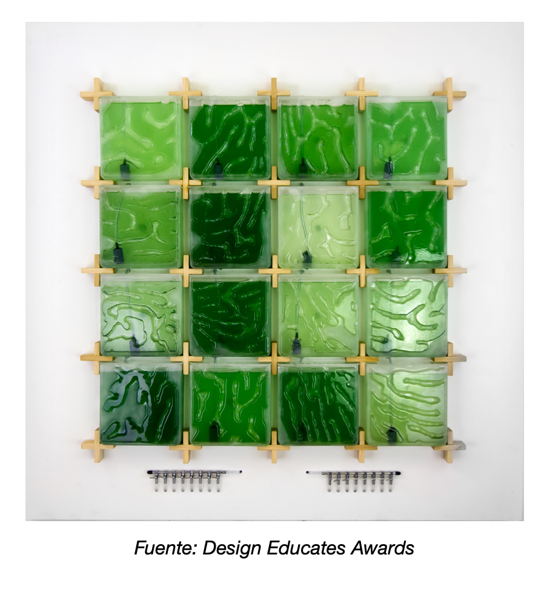

# Projects

In this page you will be able to find...

### Index
* [Technological vigilance](#tech_vigilance)
  * [Algae Carbon Offset Projects](#algae)
  * [Artificial Intelligence](#ai)
* [Business Intelligence](#bi)
  * Gender Gap
* [Process Analysis]()
  * Process and Enterprise Maturity Model 
* Information Systems
  * Cases 
* Behavorial Economics
* Design
  * Design Thiking 
  * Design Anthology
* Psychology
  * 16 Personalities 
* [Philosophy]()

----

## Technological Vigilance 

### Algae Carbon Offset Projects 
Two pilot projects in Sweden are using algae cultivation to achieve a number of sustainable effects. Besides reducing carbon dioxide emissions and purifying waste water to minimise over-fertilization, the algae cultivation produces energy-rich algae mass that can be used for biodiesel and animal feed. 

 

**Related articles** 
* [Smart City Sweden](https://smartcitysweden.com/best-practice/300/algae-projects-reduction-of-co2-and-production-of-biomass-is-climate-win-win/)
* [Standford Energy Seminar](https://youtu.be/64clWE7AfLg)
* [Forbes](https://www.forbes.com/sites/jeffmcmahon/2019/05/28/algae-single-celled-savior-of-the-climate-crisis/?sh=77ec9a2b55df)

### Artificial Intelligence

-----

## Business Inteligence 
### Gender Gap
>[Logib](https://www.logib.admin.ch/home)    
Analysis tool, enables employers to conduct their own equal pay analysis. They receive an evaluation, complete with an interpretation of the results, plus a selection of various reports and forms, charts and tables.  

-----
## Process Analysis
### Process and Enterprise Maturity Model
[Documentation](http://www.hammerandco.com/pemm.htm)
[Research](https://www.researchgate.net/publication/265220113_Michael_Hammer%27s_Process_and_Enterprise_Maturity_Model)

-----

## Behovorial Economics

-----

## Psychology
### 16 Personalities 
[Personality test](https://www.16personalities.com/free-personality-test)
-----

## Philosophy

------
[Volver](./)
