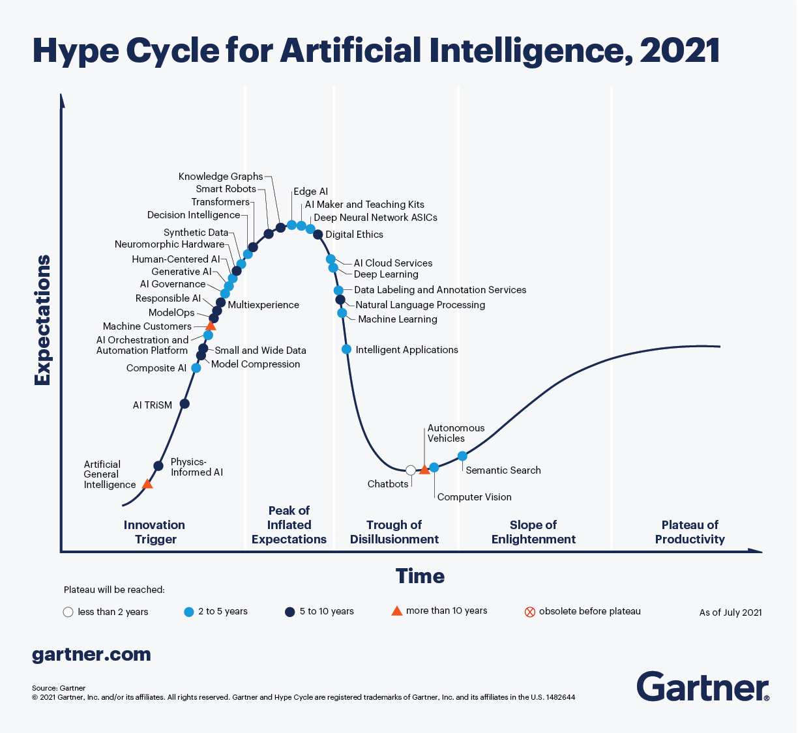

# Projects

Index
* Technological vigilance
* BI
* Process Analysis
* Philosophy 

## Technological Vigilance

### Algae Carbon Offset Projects
Two pilot projects in Sweden are using algae cultivation to achieve a number of sustainable effects. Besides reducing carbon dioxide emissions and purifying waste water to minimise over-fertilization, the algae cultivation produces energy-rich algae mass that can be used for biodiesel and animal feed. 

**Related articles**
* [Smart City Sweden](https://smartcitysweden.com/best-practice/300/algae-projects-reduction-of-co2-and-production-of-biomass-is-climate-win-win/)
* [Standford Energy Seminar](https://youtu.be/64clWE7AfLg)
* [Forbes](https://www.forbes.com/sites/jeffmcmahon/2019/05/28/algae-single-celled-savior-of-the-climate-crisis/?sh=77ec9a2b55df)

### Artificial Intelligence

## Business Inteligence

## Process Analysis

## Philosophy

------
